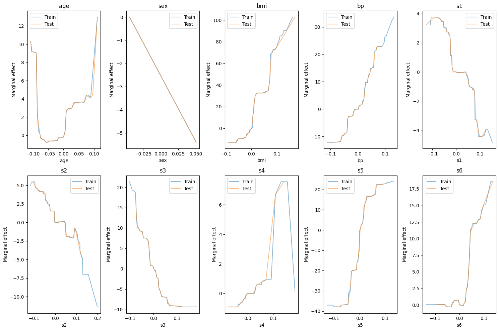

# TEAM: Tree Ensemble Additive Model

[](LICENSE)

> **Note**: This implementation is intellectual property of Antonio Di Cecco. All rights reserved for future academic publication. Do not distribute or use without explicit permission.

## Overview

TEAM (Tree Ensemble Additive Model) is a novel explainable AI model that combines the predictive power of tree ensembles with the interpretability of additive models. This implementation demonstrates TEAM's effectiveness on the diabetes dataset, showing competitive performance while maintaining full explainability.

## Key Features

- **High Performance**: Achieves superior predictive accuracy compared to traditional models
- **Interpretability**: Provides feature-wise marginal effects for transparent decision-making
- **Additivity**: Components add up to form the final prediction
- **Robustness**: Performs well on both training and test data

## Model Performance

Performance comparison on the diabetes dataset test set:

| Model | MSE | R² |
|-------|-----|-----|
| **TEAM** | **2690.79** | **0.492** |
| Random Forest | 2952.01 | 0.443 |
| Linear Regression | 2900.19 | 0.453 |
| Neural Network | 2894.86 | 0.454 |

TEAM outperforms all baseline models in both mean squared error (MSE) and coefficient of determination (R²).

## How It Works

TEAM leverages a bagging approach with gradient boosting regressors (limited to depth 1) as base estimators. The model:

1. Computes the mean of each feature and the target variable
2. Fits an ensemble model on the centered target
3. Predicts by combining the ensemble prediction with the target mean
4. Calculates marginal effects by measuring how predictions change when varying each feature while keeping others at their means

This approach ensures both additivity (components sum to total prediction) and interpretability (each feature's contribution can be visualized).

## Implementation Details

```python
class TEAM(BaseEstimator, RegressorMixin):
    """
    Tree Ensemble Additive Model (TEAM)
    Original algorithm and implementation.
    All rights reserved for future academic publication.
    """
    def __init__(self, n_estimators=100):
        self.n_estimators = n_estimators
        self.base_estimator = GradientBoostingRegressor(max_depth=1, n_estimators=100)
        self.model = BaggingRegressor(
            estimator=self.base_estimator,
            n_estimators=self.n_estimators
        )
        self.feature_means_ = None
        self.y_mean_ = None
```

The model provides a `get_marginal_effect()` method that enables feature-wise contribution analysis, facilitating understanding of how each feature impacts predictions.

## Visualizations

The implementation includes functionality to visualize marginal effects for each feature:

- X-axis: Feature values
- Y-axis: Marginal effect on prediction
- Separate plots for training and test data



These visualizations provide clear insights into how each feature contributes to predictions across its range of values. The plots show how each feature affects the model output across different values, with separate lines for training and test sets.

## Additivity Verification

The implementation verifies the additivity property, confirming that:

```
prediction = y_mean + sum(marginal_effects)
```

Mean absolute differences:
- Training set: ≈ 0.000001
- Test set: ≈ 0.000001

This verification confirms that TEAM truly functions as an additive model, where individual feature contributions sum to form the final prediction.

## Requirements

- numpy
- scikit-learn
- matplotlib

## Citation

If you use this implementation in your research, please cite:

```
Di Cecco, A. (2024). TEAM: Tree Ensemble Additive Model. [Publication pending]
```

## License

Copyright © 2024. All rights reserved.

This implementation is intellectual property of Antonio Di Cecco. The author reserves all rights for future academic publication. Do not distribute or use without explicit permission.
